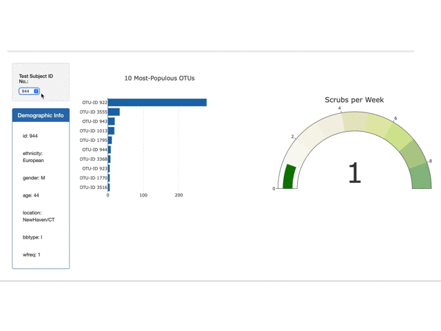

# Bacterial Counts Visualization using Plotly Library
Interactive dashboard to visualized data using D3 and Plotly library bar, gauges, and bubble charts

***

## Dashboard Specifications
- Load json data using the D3 library
- Horizontal bar chart with a dropdown menu to display the top 10 OTUs found in sample
- Add hovertext `otu_labels` to the chart.
- bubble chart that displays each sample.
- `otu_ids` indicated by marker colors.
- displays the sample's metadata (demographic information).
- displays each key-value pair from the metadata JSON object
- plots update when a new sample is selected.
- Gauge Chart to plot the weekly washing frequency of the individual (updates on select)

***

